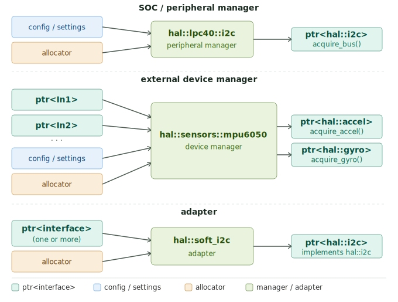

# 🏗️ Managers, Resources & Adapters

Every hardware driver in libhal is built from three distinct building blocks.
Understanding which type to reach for, and why, is the first step in writing a
correct driver.



| Type     | Owns hardware | Has vtable | Created by          |
| -------- | ------------- | ---------- | ------------------- |
| Manager  | ✅             | ❌          | `create()` factory  |
| Resource | ❌             | ✅          | Manager acquisition |
| Adapter  | ❌             | ✅          | `create()` factory  |

---

## Type Reference Legend

For clarity when reading documentation or code, please note the following mappings between `hal` aliases and their underlying types:

| Alias                  | Underlying Type                     |
| :--------------------- | :---------------------------------- |
| `hal::ptr<T>`          | `mem::strong_ptr<T>`                |
| `hal::allocator`       | `std::pmr::polymorphic_allocator<>` |
| `hal::deferred_ptr<T>` | `async::future<mem::strong_ptr<T>>` |

## Managers

A manager is the concrete class that owns and configures a single hardware
component. It is the authoritative object for that hardware. Managers cover the
full range of hardware libhal supports:

- SOC-integrated controllers: I2C bus, SPI bus, UART controller, GPIO port
- External devices connected over a protocol: an IMU over I2C, a smart servo
  over CAN, a display over SPI, a motor controller over RS-485

In both cases the role is identical. The manager initializes the hardware,
holds its configuration, and hands out resource objects that let the rest of the
application use it.

### Properties

**No vtable.** Managers are concrete classes. They do not inherit from any hal
interface and have no virtual functions. The application holds them by
`hal::ptr<ManagerType>` and interacts with them directly.

**Hidden implementation via `enable_pimpl`.** All platform-specific state lives
in a nested `impl` struct defined only in the module implementation file. The
manager's public interface file forward-declares `struct impl` and derives from
`hal::pimpl<T>`. See [Pimpl Pattern](pimpl.md).

**Single construction path.** Managers are created only through a static
`create()` factory that returns either `hal::ptr<ManagerType>` or
`hal::deferred_ptr<ManagerType>` depending if the constructor/factory needs to
perform an async operation. Constructors are restricted from normal use via the
`pimpl::private_key` parameter. See
[Construction Pattern](construction_pattern.md).

### SOC-integrated controller example

```cpp
// hal/lpc40/i2c.cppm — module interface file
namespace hal::lpc40 {

export class i2c : public hal::pimpl<i2c> {
public:
  struct impl;  // defined in i2c.cpp only

  struct settings {
    hal::hertz clock_rate = 100_kHz;
  };

  [[nodiscard]] static hal::ptr<i2c> create(
    hal::allocator p_resource,
    hal::u8 p_bus,
    settings const& p_settings = {});

  [[nodiscard]] hal::ptr<hal::i2c> acquire_i2c();

  i2c(private_key,
      hal::allocator,
      hal::u8,
      settings const&);
};

} // namespace hal::lpc40
```

### External device example

External device managers take hal interfaces as constructor dependencies rather
than touching hardware registers directly. The manager for an MPU-6050 does not
know or care whether the underlying I2C bus is hardware-accelerated,
bit-banged, or involves talking to a server.

```cpp
// hal/sensors/mpu6050.cppm
namespace hal::sensors {
export class mpu6050 : public hal::pimpl<mpu6050> {
public:
  struct impl;

  [[nodiscard]] static hal::deferred_ptr<mpu6050> create(
    async::context& p_context,
    hal::allocator p_resource,
    hal::ptr<hal::i2c> p_bus,
    hal::u8 p_address = 0x68);

  [[nodiscard]] hal::ptr<hal::accelerometer> acquire_accelerometer();
  [[nodiscard]] hal::ptr<hal::gyroscope>     acquire_gyroscope();
  [[nodiscard]] hal::ptr<hal::temperature>   acquire_temperature();

  mpu6050(private_key,
          hal::allocator,
          hal::ptr<hal::i2c>,
          hal::u8);
};
} // namespace hal::sensors
```

### Terminal external device example

Some external device managers simply do not implement an interface and thus
just provide a set of public APIs that the application can call as needed.

---

## Resources

A resource is the object a manager hands out. It implements one of the hal interfaces and is the only way application code interacts with the hardware the manager owns.

!!! NOTE
    While resources provide the standardized, generic interface used by other
    drivers to ensure interoperability, application code may also interact with
    managers directly if needed. However, we strongly prefer using resource
    interfaces to keep components decoupled. Furthermore, while a manager could
    theoretically depend on another manager, this is highly discouraged; always
    prefer finding a general `hal` interface to solve dependency issues rather
    than depending on the specific API of a manager object.

### Type erasure is the default

Resources are returned as `hal::ptr<hal::interface>`. The concrete resource type
is an implementation detail hidden in the manager's implementation file. The
application never names it.

```cpp
// Application code — the concrete type is never visible
auto manager = hal::lpc40::i2c::create(alloc, hal::port<2>, {
  .clock_rate = 400_kHz
});

// The exact i2c implementation is hidden
hal::ptr<hal::i2c> bus = manager->acquire_i2c(alloc);

// bus flows into anything that accepts hal::i2c
auto imu = co_await hal::sensors::mpu6050::create(ctx, alloc, bus);
```

Returning a type-erased interface pointer prevents ABI lock-in and lets LTO
eliminate unused virtual dispatch paths when only one concrete type is present.
Prefer this in every case where the application has no need for the concrete
type.

### Lifetime and co-ownership

Every resource co-owns its manager. Handing out a resource creates an aliasing
reference to the manager's control block. The manager cannot be destroyed while
any of its resources are live, regardless of whether the application still holds
the original manager pointer.

### Rare exceptions

Two patterns expose a concrete resource type. Both are ABI commitments and
should be treated with the same gravity as adding any public type to the library.

**Named concrete return.** Used when the resource type has a public API richer
than its base interface and callers need that API:

```cpp
// The concrete type is intentionally part of the public API
[[nodiscard]] hal::ptr<lpc40::dma_channel> acquire_dma_channel(hal::u8 p_index);
```

**Typed array return.** Used when a manager hands out a fixed set of homogeneous
resources and the array structure is meaningful to the caller:

```cpp
// Rare: typed array — callers index by pin number
[[nodiscard]] std::array<hal::ptr<hal::output_pin>, 32> acquire_output_pins();
```

!!! warning
    Both patterns bind the concrete type into the public ABI. Every future
    change to that type is a breaking change for downstream libraries. Exhaust
    type-erased alternatives before choosing either pattern.

---

## Adapters

An adapter takes one or more existing hal interfaces and presents a different
hal interface. It owns no hardware directly. Its only hardware access is through
the interfaces it holds.

Adapters are useful when:

- A software implementation of an interface can be built from simpler primitives
  (bit-bang I2C from two output pins)
- A resource needs to be scoped or decorated before being handed further down
  the dependency chain (an SPI device that manages its own chip select)
- A protocol translation layer is needed (RS-485 half-duplex framing over UART)

```cpp
// hal/soft_i2c.cppm — bit-bang I2C built on two GPIO pins
namespace hal {

export class soft_i2c : public hal::i2c {
public:
  struct settings {
    hal::hertz clock_rate = 100_kHz;
  };

  [[nodiscard]] static hal::ptr<soft_i2c> create(
    hal::allocator p_resource,
    hal::ptr<hal::output_pin> p_sda,
    hal::ptr<hal::output_pin> p_scl,
    settings const& p_settings = {});

  soft_i2c(private_key,
           hal::allocator,
           hal::ptr<hal::output_pin>,
           hal::ptr<hal::output_pin>,
           settings const&);

  hal::ptr<hal::output_pin> m_sda;
  hal::ptr<hal::output_pin> m_scl;
};

} // namespace hal
```

Adapters store all hal interface dependencies as `hal::ptr<T>` members, as with
any stored dependency. They are constructed via `create()` like managers.
Unlike managers they implement hal interfaces directly, so they carry a vtable
rather than a pimpl.

---

## Naming Conventions

### Managers Naming

**SOC-integrated controllers** live in a namespace named after the MCU family.
The class name matches the hardware block. The name of the driver should
closely match the name of the peripheral within the datasheet. For example,
`hal::stm32f1::advanced_timer` which contains timers, pwm output channel, pwm
input channels, quadrature encoding, and more.

```
hal::lpc40::i2c              — LPC40xx series I2C controller
hal::lpc40::spi              — LPC40xx series SPI controller
hal::stm32f1::usart          — STM32F1 series USART controller
hal::stm32f1::advanced_timer — STM32F1 series advanced timer peripheral
hal::rp2040::pwm             — RP2040 PWM block
```

**External device managers** live in a namespace named after the device
category. The class name is the part number or established name of the device.

```
hal::sensors::mpu6050      — InvenSense MPU-6050 IMU
hal::displays::ssd1306     — Solomon SSD1306 OLED controller
hal::actuators::dynamixel  — Robotis Dynamixel smart servo
hal::io::pca9685           — NXP PCA9685 PWM expander
```

### Adapters Naming

Adapters live in the `hal` namespace and are named after the interface they
produce, prefixed with the construction strategy or protocol where it adds
clarity.

```
hal::soft_i2c      — software bit-bang I2C
hal::soft_spi      — software bit-bang SPI
hal::spi_device    — SPI bus + chip select → spi_device interface
```

### Resources Naming

Resources have no naming rule. Their concrete types are implementation details
defined in module implementation files and are never part of the public API
under normal circumstances.

---

## Which type am I building?

| Question                                                                      | Type         |
| ----------------------------------------------------------------------------- | ------------ |
| Does it own and configure a piece of hardware (chip, sensor, actuator)?       | **Manager**  |
| Is it produced by a manager and handed to the application as a hal interface? | **Resource** |
| Does it transform one or more existing hal interfaces into a different one?   | **Adapter**  |

When the answer spans two rows, the design needs a second look. A class that
both owns hardware and implements a hal interface directly is trying to be both
a manager and a resource. Split it: the manager owns the hardware, the resource
implements the interface.