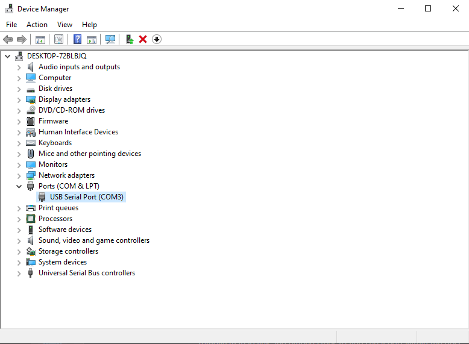

# 🚀 Getting Started

## 🧰 Install Prerequisites

What you will need in order to get started with libhal.

- `pipx`: 1.5.0 or above
- `git`: usually preinstalled on all operating systems except for Windows

Skip these steps if you already have both of these installed

=== "Ubuntu 20.04+"

    !!! info

        If you are using 20.04 you will need to upgrade Python to 3.10:

        ```bash
        sudo apt update
        sudo apt install software-properties-common -y
        sudo add-apt-repository ppa:deadsnakes/ppa
        sudo apt install Python3.10
        ```

    Install `pipx` and set it up:

    ```bash
    sudo apt install pipx
    pipx ensurepath
    ```

=== "MacOS X"

    Install Homebrew:

    ```
    /bin/bash -c "$(curl -fsSL https://raw.githubusercontent.com/Homebrew/install/HEAD/install.sh)"
    ```

    Install latest version of Python, pipx:

    ```bash
    brew install python
    brew install pipx
    pipx ensurepath
    ```

    Install Rosetta (only required for M1 macs):

    ```bash
    /usr/sbin/softwareupdate --install-rosetta --agree-to-license
    ```

=== "Windows"

    We recommend using the `choco` package manager for windows as it allows
    easy installation of tools via the command line.

    To install `choco`, open PowerShell as an administrator and run the
    following command:

    ```powershell
    Set-ExecutionPolicy Bypass -Scope Process -Force; [System.Net.ServicePointManager]::SecurityProtocol = [System.Net.ServicePointManager]::SecurityProtocol -bor 3072; iex ((New-Object System.Net.WebClient).DownloadString('https://community.chocolatey.org/install.ps1'))
    ```

    !!! tip

        If the `choco` command doesn't work after running this script try
        closing and opening again PowerShell.

    When `choco` prompts you to run install scripts from the commands below
    enter `all` so it can install everything.

    Install `git`, `python` and `pipx` (must be in admin powershell):

    ```powershell
    choco install git
    choco install python --version=3.12.2
    python -m pip install --user pipx
    python -m pipx ensurepath
    ```

    In order to build packages and applications targeting Windows you must
    install **Visual Studio**. You can install it using `winget` in an admin
    powershell:

    ```powershell
    winget install Microsoft.VisualStudio.2022.BuildTools --override "--add Microsoft.VisualStudio.Workload.VCTools --includeRecommended -p --installWhileDownloading"
    ```

    Or you can the install found on [visualstudio.microsoft.com](https://visualstudio.microsoft.com/).

    There is no more installation required at this point.
    Close and reopen powershell as a normal user now.

---

## Installing Conan

To install conan, simply run the following pipx command:

```bash
pipx install "conan>=2.18.0"
```

## 🔧 Setting up Conan

First install the libhal's conan configuration which is done via the commnd below.

```bash
conan config install https://github.com/libhal/conan-config2.git
```

This will install of the `conan hal` command and files needed to build for
various target devices and platforms.

Now run the conan hal setup command:

```bash
conan hal setup
```

This will add the libhal package repository to the list of remote repos to
search for packages in. This will also generate a default conan profile if one
does not already exist.

Setup is now done. Its time to build an application.

## 🛠️ Building Demos

Before start building demos, we have to consider on what device do we plan to
run the demo on? ARM microcontrollers are quite common so lets use that as an
example. Lets clone the `libhal-arm-mcu` repo.

```bash
git clone https://github.com/libhal/libhal-arm-mcu.git
cd libhal-arm-mcu
```

To build a libhal demo, you must first create the latest version of the library
package like so:

=== "STM32F103"

    ```bash
    conan create . -pr:a hal/tc/gcc -pr hal/mcu/stm32f103c8
    ```

=== "LPC4078"

    ```bash
    conan create . -pr:a hal/tc/gcc -pr hal/mcu/lpc4078
    ```

With the latest package installed within your conan cache, you can now build
the demo applications:

=== "STM32F103"

    ```bash
    conan build demos -pr:a hal/tc/gcc -pr hal/mcu/stm32f103c8
    ```

=== "LPC4078"

    ```bash
    conan build demos -pr:a hal/tc/gcc -pr hal/mcu/lpc4078
    ```

You can find binaries of your application within the
`demos/build/lpc4078/MinSizeRel/` for `lpc4078` and
`demos/build/stm32f103c8/MinSizeRel/` for the `stm32f103c8`

!!! error

    The following error occurs when an application was built with a compiler that has since been deleted.

    ```
      The CMAKE_CXX_COMPILER:

        /Users/user_name/.conan2/p/b/arm-ged7418b49387e/p/bin/bin/arm-none-eabi-g++

      is not a full path to an existing compiler tool.
    ```

    To fix this, simply delete your build directory and build again.

    ```
    rm -r demos/build
    ```

## 💾 Uploading Demos to Device

In order to complete this tutorial you'll one of these devices:

- LPC4078 MicroMod with SparkFun ATP board
- SJ2 Board
- STM32F103 MicroMod with SparkFun ATP board
- STM32 Blue Pill along with USB to serial adapter

=== "STM32F103"

    Install the `stm32loader` flashing software for STM32 devices:

    ```bash
    pipx install stm32loader
    ```

    then

    ```bash
    stm32loader -e -w -v -B -p /dev/tty.usbserial-10 demos/build/stm32f103c8/MinSizeRel/uart.elf.bin
    ```

    Replace `/dev/tty.usbserial-10` with the correct port
    name of the device plugged into your computer via USB.

    Use `demos/build/stm32f103c8/Debug/uart.elf.bin` or replace it with any
    other application to be uploaded.

=== "LPC4078"

    Install the [`nxpprog`](https://pypi.org/project/nxpprog/) flashing software
    for LPC devices:

    ```bash
    pipx install nxpprog
    ```

    !!! tip

        On Ubuntu 22.04 you will need to use the command `python3.10` because
        the default python is usually 3.8.

        ```bash
        pipx install nxpprog
        ```

        On other systems you may have to just use `python` as the command.

    ```bash
    nxpprog --control --binary demos/build/lpc4078/MinSizeRel/uart.elf.bin --device /dev/tty.usbserial-140
    ```

    - Replace `/dev/tty.usbserial-140` with the correct port
      name of the device plugged into your computer via USB.
    - Replace `uart.elf.bin` with any other application found in the
      `demos/applications/` directory.

!!! question

    Don't know which serial port to use?

    ### On Linux

    With the device unplugged, run the below command

    ```
    $ ls /dev/ttyUSB*
    ls: cannot access '/dev/ttyUSB*': No such file or directory
    ```

    Plug the device into the USB port, then rerun the command, the device
    should appear in the result:

    ```
    $ ls /dev/ttyUSB*
    /dev/ttyUSB0
    ```

    The device may also be under the name `/dev/ttyACM*`, like below

    ```
    $ ls /dev/ttyACM*
    /dev/ttyACM0
    ```

    From the above 2 examples for device name, the port name in the
    `stm32loader` command would be replaced with `/dev/ttyUSB0` or
    `/dev/ttyACM0` respectively.

    ### On Mac

    With the device unplugged, run the below command

    ```
    $ ls /dev/tty.usbserial-*
    zsh: no matches found: /dev/tty.usbserial-*
    ```

    Plug the device into the USB port, then rerun the command, the device
    should appear in the result:

    ```
    $ ls /dev/tty.usbserial-*
    /dev/tty.usbserial-14240
    ```

    From the above example for the device name, the port name in the
    `stm32loader` command would be replaced with `/dev/tty.usbserial-14240`.

    ### On Windows

    Open Device Manager, by pressing the Windows key and typing
    "Device Manager", then pressing enter.

    Once the Device Manager window is open, plug the device in to your computer
    via USB and expand the `Ports (COM & LPT)` menu. The device should be
    visible in the list with a COM port like below:

    
    From the above screenshot, the port name in the `stm32loader` command would
    be replaced with `COM3`.

!!! question

    stm32loader command failed because it doesn't have permission?

    ### On Linux

    Add yourself to the dialout user group to give yourself the permission.
    This group has the permission to talk to serial ports.

    ```
    $ usermod -a -G dialout $USER
    ```

## ⚡️ Changing Built Type

The build type determines the optimization level of the project. The libhal
default for everything is `MinSizeRel` because code size is one of the most
important aspects of the project.

You can also change the `build_type` to following build types:

- 🧪 **Debug**: Turn on some optimizations to reduce binary size and improve
  performance while still maintaining the structure to make debugging easier.
  Recommended for testing and prototyping.
- ⚡️ **Release**: Turn on optimizations and favor higher performance
  optimizations over space saving optimizations.
- 🗜️ **MinSizeRel**: Turn on optimizations and favor higher space saving
  optimizations over higher performance.

To override the default and choose `Release` mode simply add the following to
your conan command: `-s build_type=Release`

## 🎉 Creating a new Project

Start by cloning `libhal-starter`:

```bash
git clone https://github.com/libhal/libhal-starter.git
```

Take a look at the `README.md` of
[libhal/libhal-starter](https://github.com/libhal/libhal-starter) to get
details about how to modify the starter project and make it work for your needs.

!!! tip

    In the future we will provide this via the `conan new` command, using
    templates installed via `conan-config2`.
